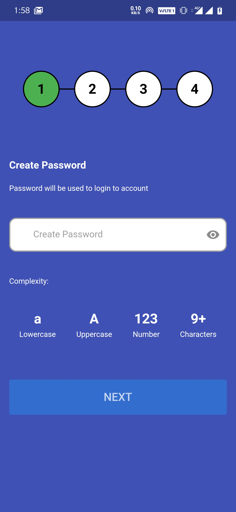

# flutter_registration

      Sample demo application to display registration process. This project uses Provider for state management.

##### Getting Started
### Highlights
  + Flutter
  + Provider 

### Pre-requisites
  + Android Studio v4.0.1
  + Flutter 1.20.2

## Demo App
To run the project, clone the repository and run it via Android Studio.
